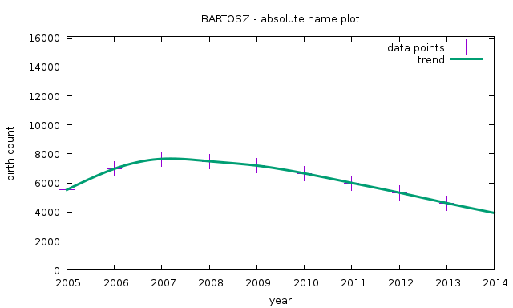
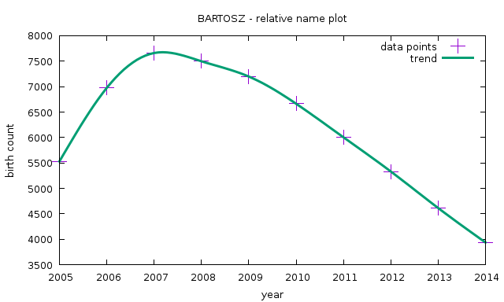
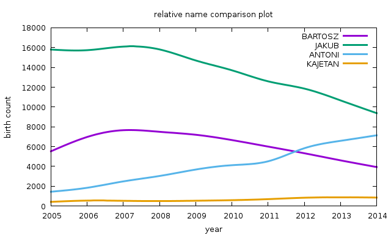

<meta http-equiv='Content-Type' content='text/html; charset=utf-8' />

# child name selector helper

set of scripts, that help to choose a reasonable name for a child, thanks to usage of historical data.
the aim is to select a name that is neither too popular (i.e. non-distinguishable) nor too uncommon (i.e. does not appear to be "from a different times").

## system requirements

python scripts should run on any machine, that has python 2.7 interpreter installed.

for shell scripts you will need linux with bash and gnuplot installed.
if you don't, your options are: virtual machine with linux, docker for windows, bash for windows.

## tools

project consists of tools, that can help you select and visualize certain pieces of information.

### selector

python script for selecting names, that match given probability criteria.
for instance selecting name that is probable from 0.7% to 2.5%, based on males name, can be done like this:

`./selector myinputdata.csv 0.7 2.5`

actual input data for Poland, taken from GUS, are prepared in the 'input' directory, inside this repository.

example results from name "bartosz", and name percentage between 1.0% and 1.8%:

    OLIWIER  ->  median  1.38393638684  average  1.3631010423
    NIKODEM  ->  median  1.05499811114  average  0.943908827288
    KRZYSZTOF  ->  median  1.36523623244  average  1.35055512726
    MAKSYMILIAN  ->  median  1.36090149358  average  1.35048363984
    BARTŁOMIEJ  ->  median  1.21620139308  average  1.20137801002
    PAWEŁ  ->  median  1.74911789978  average  1.68299771132
    FRANCISZEK  ->  median  1.55761948199  average  1.47722826836
    OSKAR  ->  median  1.62994904682  average  1.6204037682
    ALAN  ->  median  1.19060677526  average  1.15634884651
    SEBASTIAN  ->  median  1.10861665934  average  1.07486624005
    KAROL  ->  median  1.52584134021  average  1.61267488051
    KRYSTIAN  ->  median  1.05669207847  average  0.969100560537
    MIŁOSZ  ->  median  1.05499811114  average  1.10955108229
    MARCEL  ->  median  1.56130506491  average  1.49543540293
    TOMASZ  ->  median  1.34121591812  average  1.34879158451
    HUBERT  ->  median  1.27352748385  average  1.25000014053
    KAMIL  ->  median  1.59280791239  average  1.66962072658
    ADRIAN  ->  median  1.19791952321  average  1.1153006219

### plot_name

shell script for plotting popularity of a given name in time.
requires bash and gnuplot to work.
example query, for name "BARTOSZ", from a given input file, can be seen:

`./plot_name "myinputdata.csv "BARTOSZ" relative`

last option can be "relative" or "absolute".

"relative" means OY axis is scaled, based on min/max values from a given query.
it is useful for precise monitoring of per-name trends.

"absolute" means OY axis is scaled, based on maximum birth count, of the most popular name of all years.
it is useful for comparing plots of different names.

example absolute plot for name "bartosz":

example relative plot for name "bartosz":

### analyze_all

shell script that displays all the results for a given query.
for each name a separate window is opened, displaying per-name results.

example call, for percentage between 1.2% and 2.3%, plotted with relative values, follows:

`./analyze_all "myinputdata.csv 1.2 2.3 relative`

### compare_names

shell script that plots multiple names trends, on a single plot.
it is useful for doing analysis between different options.

example run, plotting 4 names, follows:

`./compare_names input/male.csv relative BARTOSZ JAKUB ANTONI KAJETAN`

which results in a following plot:

